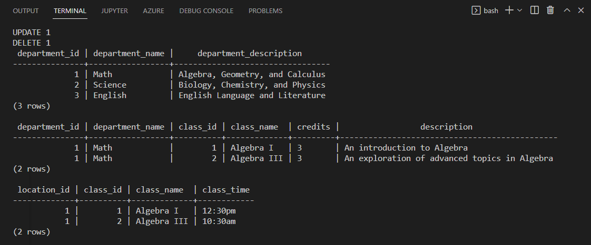

# School Database with SQL

This project features an Entity Relationship diagram of a school database made with drawio and the corresponding school database SQL code. 

## Launch Instructions

Clone or download this repository to your local machine. 

Please verify that docker desktop has been installed on your machine. If it hasn't, please visit [here for Windows](https://hub.docker.com/editions/community/docker-ce-desktop-windows/) or [here for Mac](https://docs.docker.com/docker-for-mac/install/)  for installation instructions.

Open the file folder in VS code.

Open Docker Desktop and wait for it to finish loading.

In VS code, click View -> Terminal.

In the terminal, type in the following command to start the containers from the docker-compose.yml file:
docker compose up -d

Run the following to launch the database:
cat school_database.sql | docker exec -i pg_container psql

You will see notifications in the terminal of the additions:

Terminal Screenshot

Note that at the end of the output, the SQL queries from the last section will also run:

SQL Query Results Screenshot

Open the pgAdmin panel in your browser:
http://localhost:5433

Click on "Add New Server"

Add a Name in the General tab.
Add 'pg' as the Host Name/Address on the connection Tab.
Click Save.
 
On the left side, double click on the Servers button. follow the path:
Servers -> School -> Databases -> Schemas -> Tables 
This will bring you to the list of all 8 of the tables created with this database.

The pgAdmin Panel:

By right-clicking on one of the tables in the list and then selecting View/Edit Data -> All Rows, you can see the data from the INSERT statements has populated.

Viewing Data Added by the INSERT Statements:

## Reflection

I created this database after finishing NuCamp's Back End, SQL, and DevOps Developer with Python bootcamp. The goal was to practice creating an Entity Relationship Diagram as well as converting the diagram into SQL code. Additionally, some SELECT statements were added to perform a few SQL queries that could potentially be required by school admin to run.

## References

- "Entity-Relationship Diagram: School Class Generation" - https://www.youtube.com/watch?v=r4t3-tvL8B0 (Inspiration for the Entity Relationship diagram.)
- NuCamp's Back End, SQL, and DevOps Developer with Python Bootcamp (The docker-compose.yml and .env files as well as the database configuration setup at the top of the school_database.sql file were adapted from the NuCamp curriculum as a simple way to run the database. Original code for this project starts at the 'CREATE Tables' line.)